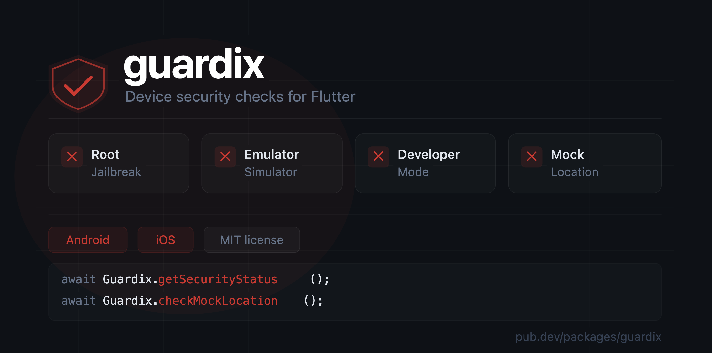

# guardix



A Flutter plugin for device security checks on Android and iOS.

Detects four categories of security concerns:

- **Root / jailbreak** — su binaries, Magisk, Shamiko/Zygisk, root apps, system write access (Android) · suspicious
  files, sandbox violations, dylib injection (iOS)
- **Emulator / simulator** — build fingerprints, hardware identifiers, environment variables
- **Developer mode** — developer options, USB debugging (Android) · debugger attachment, Frida instrumentation via port
  scan + dylib analysis (iOS)
- **Mock / fake location** — isMock flag, AppOps check, spoofing app detection (Android) · CLLocationSourceInformation (
  iOS)

## Platform support

| Android | iOS |
|---------|-----|
| ✅       | ✅   |

## Installation

Add to your `pubspec.yaml`:

```yaml
dependencies:
  guardix: ^0.2.0
```

### Android setup

No manifest changes required for root, emulator, developer mode, and Frida
detection — all package visibility declarations are bundled inside the plugin
automatically.

**If you use mock location detection**, add location permissions to your app's
`android/app/src/main/AndroidManifest.xml`:

```xml

<uses-permission android:name="android.permission.ACCESS_FINE_LOCATION"/>
<uses-permission android:name="android.permission.ACCESS_COARSE_LOCATION"/>
```

### iOS setup

`LSApplicationQueriesSchemes` must be declared in your app's
`ios/Runner/Info.plist` — iOS does not merge plugin Info.plist files
automatically, so URL scheme declarations must live in your app.

**For jailbreak detection**, add:

```xml

<key>LSApplicationQueriesSchemes</key>
<array>
<string>cydia</string>
<string>sileo</string>
<string>zbra</string>
<string>undecimus</string>
<string>filza</string>
</array>
```

> This enables `canOpenURL()` checks for known jailbreak app schemes (Cydia,
> Sileo, Zebra, etc.). Without it, iOS silently blocks these checks and they
> always return `false`. Note that this is a **secondary check** — guardix
> primarily detects jailbreaks through file system inspection, sandbox
> violations, and dylib analysis, which require no setup and work
> independently of this declaration.

**If you use mock location detection**, add:

```xml

<key>NSLocationWhenInUseUsageDescription</key>
<string>Required to verify location integrity as part of device security checks.</string>
```

## Usage

### Device security status

```dart
import 'package:guardix/guardix.dart';

final status = await
Guardix.getSecurityStatus
();

// Check individual flags and define your own security policy
print
(
status.isDeveloperMode); // true / false
print(status.isEmulator); // true / false
print(status.isRootedOrJailbroken); // true / false

// Banking app — block on root or jailbreak
if (status.isRootedOrJailbroken) {
// block access
}

// Fintech app — stricter policy
if (status.isRootedOrJailbroken
|| status.isDeveloperMode
|| status.isEmulator) {
// block access
}
```

### Mock location detection

Mock location is a separate call from `getSecurityStatus()` because it
involves a location fix and is heavier than the other checks. Call it
only when your app needs location integrity verification.

```dart
// Strict mode (default) — flags device if a known GPS spoofing app
// is installed, even if not currently active.
// Recommended for banking and fintech apps.
final isMock = await
Guardix.checkMockLocation
();

// Lenient mode — only flags when mock location is actively running.
final isMock = await
Guardix.checkMockLocation
(
strictMode: false);

if (isMock) {
// block the transaction / delivery / ride
}
```

> For best accuracy, call `checkMockLocation()` after your app has already
> obtained a location fix for its own business logic. This ensures the native
> location cache is fresh on both Android and iOS. Since mock location
> detection is only relevant when your app uses location, a fresh fix will
> already be available in the natural usage flow.

### Example — block the app on a rooted or jailbroken device

```dart
@override
void initState() {
  super.initState();
  _checkDevice();
}

Future<void> _checkDevice() async {
  final status = await Guardix.getSecurityStatus();

  // Define your own security policy
  final bool isUnsafe = status.isRootedOrJailbroken
      || status.isDeveloperMode
      || status.isEmulator;

  if (isUnsafe && mounted) {
    showDialog(
      context: context,
      barrierDismissible: false,
      builder: (_) =>
          AlertDialog(
            title: const Text('Security check failed'),
            content: const Text(
                'This app cannot run on rooted, jailbroken, or compromised devices.'),
            actions: [
              TextButton(
                onPressed: () => SystemNavigator.pop(),
                child: const Text('Exit'),
              ),
            ],
          ),
    );
  }
}
```

### Example — check mock location before a transaction

```dart
Future<void> _onConfirmTransaction() async {
  final isMock = await Guardix.checkMockLocation();

  if (isMock && mounted) {
    showDialog(
      context: context,
      barrierDismissible: false,
      builder: (_) =>
          AlertDialog(
            title: const Text('Location integrity check failed'),
            content: const Text(
                'This transaction cannot be completed from a spoofed location.'),
            actions: [
              TextButton(
                onPressed: () => Navigator.pop(context),
                child: const Text('OK'),
              ),
            ],
          ),
    );
    return;
  }

  // proceed with transaction
}
```

## API reference

### `Guardix.getSecurityStatus()`

Returns a `DeviceSecurityStatus` object. Fast and lightweight — safe to
call on app launch.

### `Guardix.checkMockLocation({bool strictMode = true})`

Returns a `bool`. Involves a location fix — call after your app has
already obtained a location for its own business logic.

| Parameter    | Default | Description                                             |
|--------------|---------|---------------------------------------------------------|
| `strictMode` | `true`  | Also flags installed GPS spoofing apps even if inactive |

### `DeviceSecurityStatus`

| Property               | Type   | Description                                                                             |
|------------------------|--------|-----------------------------------------------------------------------------------------|
| `isDeveloperMode`      | `bool` | Developer options or USB debugging enabled (Android) · debugger or Frida attached (iOS) |
| `isEmulator`           | `bool` | Running on an emulator or simulator                                                     |
| `isRootedOrJailbroken` | `bool` | Device is rooted (Android) or jailbroken (iOS)                                          |

## Detection coverage

### Android

| Check                      | Method                                                         |
|----------------------------|----------------------------------------------------------------|
| Developer options          | `Settings.Global.DEVELOPMENT_SETTINGS_ENABLED`                 |
| USB debugging              | `Settings.Global.ADB_ENABLED`                                  |
| Emulator                   | Build fingerprint, hardware, product identifiers (15+ signals) |
| Su binary                  | 18 known paths including Magisk modern paths                   |
| Root apps                  | Magisk, SuperSU, Xposed and 9 others                           |
| Magisk / Zygisk            | `/data/adb/` paths + `/proc/self/maps` scan                    |
| Shamiko                    | Module paths + maps scan                                       |
| Frida                      | Port scan (27042, 27043, 4444) + `/proc/self/maps`             |
| Mock location (API 31+)    | Fresh `Location.isMock` flag via `getCurrentLocation()`        |
| Mock location (API 23–30)  | `AppOpsManager.OPSTR_MOCK_LOCATION`                            |
| Mock location (pre-API 23) | `Settings.Secure.ALLOW_MOCK_LOCATION`                          |
| Mock location apps         | 15 known spoofing apps (strict mode only)                      |

### iOS

| Check                       | Method                                                    |
|-----------------------------|-----------------------------------------------------------|
| Developer mode (iOS 16+)    | `sysctlbyname("security.mac.amfi.developer_mode_status")` |
| Developer mode (pre-iOS 16) | Debugger attach, Frida, env vars, injected code           |
| Debugger attachment         | `sysctl` + `P_TRACED` flag                                |
| Frida                       | Port scan + dylib name scan (12 patterns)                 |
| Simulator                   | `targetEnvironment(simulator)` + env var                  |
| Jailbreak files             | 38 paths including Dopamine, Palera1n, Unc0ver            |
| Jailbreak URL schemes       | Cydia, Sileo, Zebra, Filza, Undecimus                     |
| Sandbox violation           | Write attempt outside sandbox                             |
| Injected dylibs             | MobileSubstrate, TweakInject, Zygisk, Shamiko             |
| Binary encryption           | Mach-O `cryptid` check (release builds only)              |
| Mock location (iOS 15+)     | `CLLocationSourceInformation.isSimulatedBySoftware`       |

## Important notes

- Detection can be bypassed by sophisticated tools such as Magisk with DenyList
  on Android and rootless jailbreaks on iOS. No purely user-space solution
  is bypass-proof.
- `isDeveloperMode` and `isEmulator` return `true` during development and on
  simulators — factor this into your logic during testing.
- The binary encryption check (`hasInjectedCode`) is skipped in debug builds
  to avoid false positives during development.
- `checkMockLocation()` returns `false` if location permission is denied.
- On iOS below 15.0, mock location detection is not available and always
  returns `false`.

## License

MIT